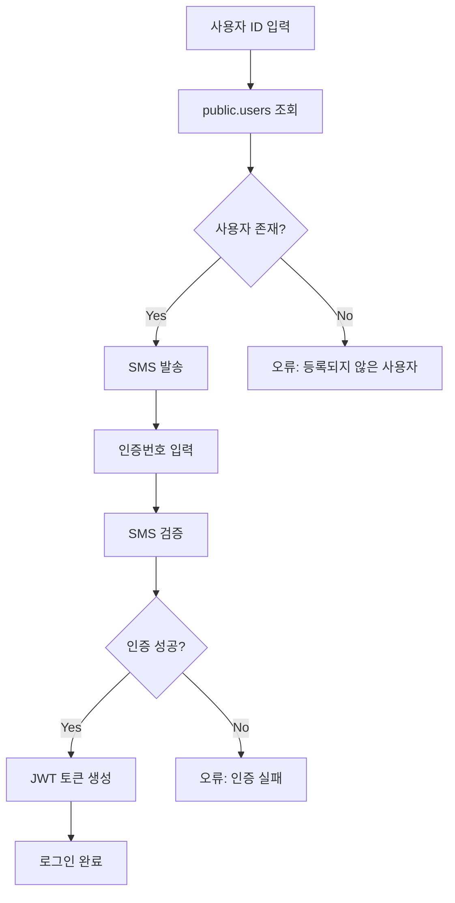

# 🔐 인증 시스템 아키텍처

## 현재 구조 (Custom Auth)

### ✅ **사용 중인 테이블**
- `public.users` - 사용자 정보 (user_id, phone, role 등)
- `sites` - 사업장 정보

### ❌ **사용하지 않는 기능**
- `auth.users` (Supabase Authentication)
- Supabase Auth API
- OAuth 로그인

## 인증 플로우



## 테이블 구조

### public.users
| 컬럼 | 타입 | 설명 |
|------|------|------|
| id | uuid | Primary Key |
| user_id | text | 로그인 ID (admin, staff 등) |
| phone | text | 전화번호 (SMS 인증용) |
| name | text | 사용자 이름 |
| role | text | 권한 (admin/staff) |
| site_id | uuid | 소속 사업장 |

### 초기 데이터
```sql
-- 관리자
admin / 01087654321 / admin

-- 직원  
staff / 01023456789 / staff

-- 조회용
viewer / 01012345678 / staff
```

## 보안 특징

### ✅ **장점**
- 전화번호 기반 인증 (한국 환경에 적합)
- 단순한 구조
- SMS 2FA 내장
- 사업장별 권한 관리

### ⚠️ **주의사항**
- JWT Secret 보안 관리 필요
- SMS 발송 비용 고려
- 전화번호 변경 시 업데이트 필요

## 설정 방법

### 1. 테이블 생성
```sql
\i '/supabase/schema.sql'
```

### 2. 초기 데이터
```sql  
\i '/supabase/seed_users.sql'
```

### 3. 환경 변수
```bash
# JWT 토큰용
JWT_SECRET=your-secret-key

# HMAC QR 서명용  
VOUCHER_HMAC_SECRET=your-hmac-key
```

## FAQ

**Q: Supabase Authentication 사용해야 하나요?**
A: 아니요. 현재 Custom Auth로 충분합니다.

**Q: auth.users 테이블이 비어있어도 되나요?**
A: 네. public.users만 사용합니다.

**Q: OAuth 로그인 추가할 수 있나요?**
A: 가능하지만 현재 SMS 인증이 더 적합합니다.